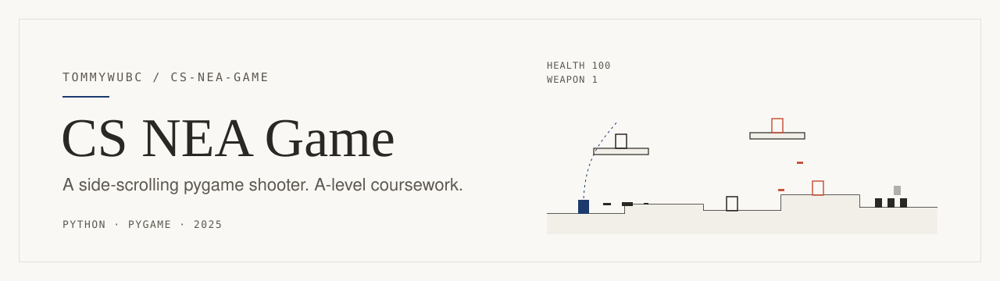
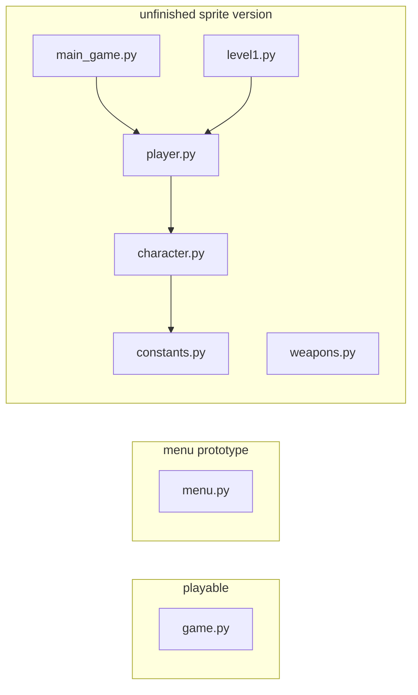

<picture>
  <source media="(prefers-color-scheme: dark)" srcset=".github/assets/banner-dark.svg">
  
</picture>

A 2D side-scrolling shooter platformer in Python and pygame, written for my A-level Computer Science NEA (the coursework project). It's earlier work, uploaded in one go in March 2025, and it's a snapshot of a project partway through. The game itself is playable. The menu, levels, and sprite-based player it was going to plug into are still separate pieces.

## The game

You're a blue block at the left end of a 2,500-pixel level made of uneven ground and four floating platforms. The level is full of enemies, and you win when you've killed all of them. You lose when your health reaches zero or you fall off the bottom of the screen. The camera follows you horizontally.

**Enemies.** There are three kinds, all drawn as colored rectangles:

| Enemy | Color | Health | Behaviour |
| --- | --- | --- | --- |
| Regular | red | 300 | Patrols. Chases you within 400 px (at most 5 enemies chase at a time). Hops every ~2 s if spawned on the ground. |
| Ranged | purple | 300 | Patrols and fires an orange bullet (12 damage) toward you every 1.6 s while you're within 400 px. |
| Duplicating | green, smaller | 20 | Weak, but every 2 s each one clones itself while the swarm is below its starting size (15), so you have to thin it faster than it refills. |

Each of the four floating platforms gets a stationary regular or ranged enemy that walks back and forth across it. Touching an enemy drains health: 3 per hit from regular and ranged enemies, 1.5 from duplicators. After each hit you get a 100 ms grace window. Killing a regular or ranged enemy heals you 2.

**Weapons.** `S` cycles through three guns. The HUD shows health and the current weapon number.

| # | Damage | Fire delay | Bullet speed |
| --- | --- | --- | --- |
| 1 | 40 | 300 ms | 18 |
| 2 | 80 | 600 ms | 12 |
| 3 | 20 | 150 ms | 15 |

Player bullets travel up to 800 px and stop when they hit a platform.

## Controls

These come straight from the key handling in `game.py`:

| Key | Action |
| --- | --- |
| `←` / `→` | Move (hold) |
| `↑` | Jump. Press again in the air for a double jump. |
| `Space` | Shoot. One shot per press, limited by the weapon's fire delay. |
| `S` | Switch weapon (1 → 2 → 3 → 1) |
| `R` | Restart, on the Game Over or You Won screen |

Close the window to quit.

## Run it

You need Python 3 and pygame. There are no image or sound assets. Everything is drawn with `pygame.Surface` rectangles.

```bash
pip install pygame
python game.py      # the game
python menu.py      # the menu prototype, runs on its own
```

`game.py` is the entry point. It doesn't import any of the other files.

## Code map



| File | What's in it |
| --- | --- |
| `game.py` | The whole game in about 700 lines: physics constants, the `Player`, `Enemy`, `RangedEnemy`, `DuplicatingEnemy`, `Bullet`, `EnemyBullet` and `Platform` sprites, level setup, the main loop, and the win/lose/restart screens. |
| `menu.py` | A separate menu: Start Game → type a username (with a blinking cursor) → choose Level 1–5. Choosing a level just prints `Starting Level N`. Settings and Leaderboard print placeholders. |
| `main_game.py` | Start of a sprite-based rewrite: a 1600×1040 window that draws the player image. |
| `character.py` | `Character` sprite that loads `player_idle1.png` and scales it by 3. |
| `player.py` | Creates the one `Character` instance. |
| `level1.py` | Stub: opens a "Level 1" window and nothing else. |
| `constants.py` | Screen size and sprite scale for the sprite version. |
| `weapons.py` | Empty placeholder. |

## Notes

- **The sprite version won't run from a fresh clone.** `character.py` loads its image from an absolute Windows path (`C:/Users/...`), `main_game.py` loads it from `NEA_game/Assets/`, and that image isn't in this repo. Stick to `game.py`.
- **The menu and the game were never wired together.** Picking a level in `menu.py` doesn't start `game.py`.
- **Restarts vary a little.** On a fresh start, 9 ground enemies and 15 duplicators spawn. Restarting after a loss gives 6 and 16, and after a win 8 and 14. Enemy types and positions are random every time.
- There are no tests and no license file.
